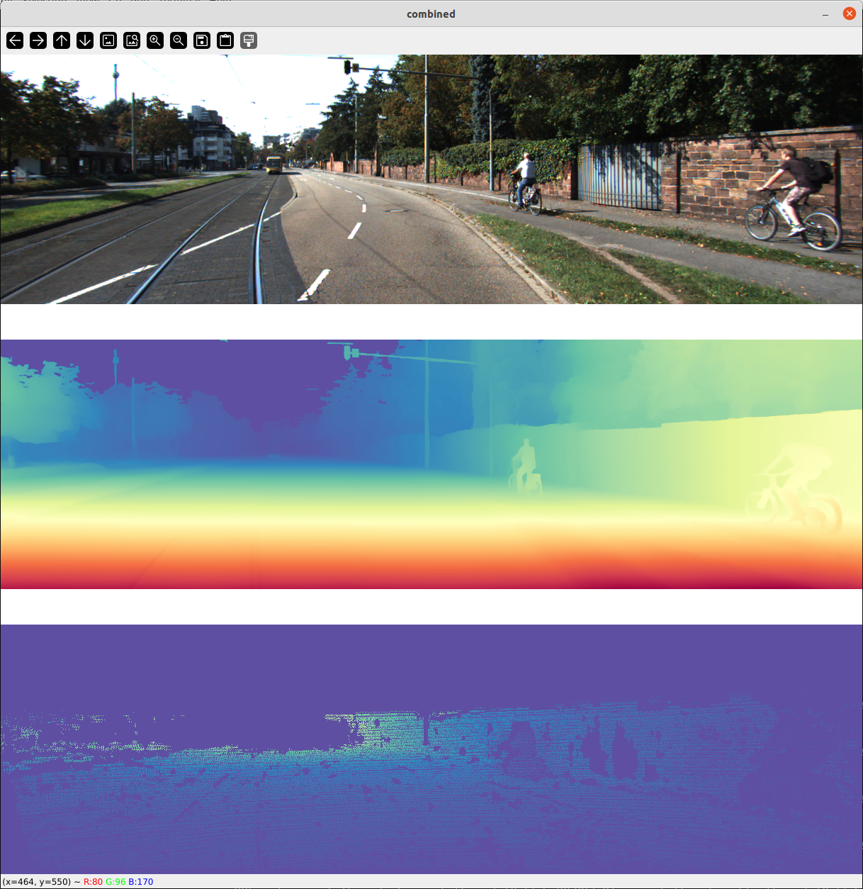
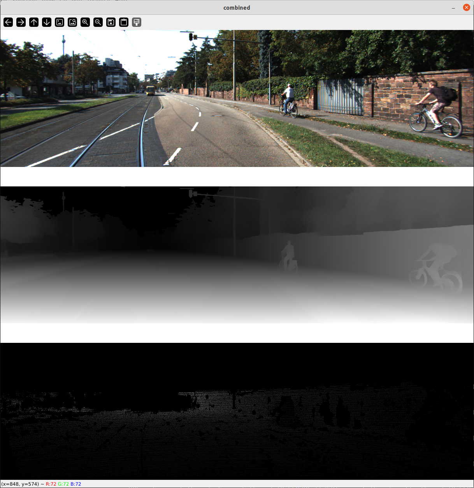
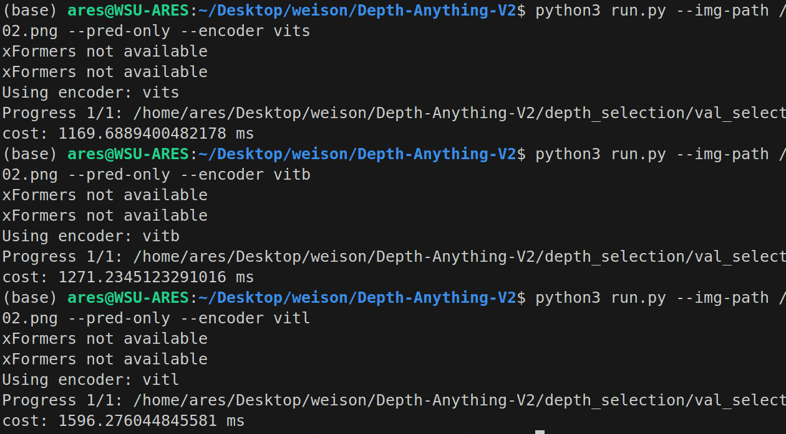

### 比较 DepAny2 的 inference 结果和 groudtruth
默认使用 vits 模型
```
python3 ./scripts/test_depth_synch.py --raw_img_path depth_selection/val_selection_cropped/image/2011_09_26_drive_0002_sync_image_0000000005_image_02.png
```

<div style="display: flex; justify-content: space-between; align-items: center;">
  <div style="text-align: center; width: 45%;">
    
    <p><strong>grayscale映射rgb模式</strong></p>
  </div>
  <div style="text-align: center; width: 45%;">
    
    <p><strong>grayscale模式</strong></p>
  </div>
</div>

### 模型
1.2G的最大参数量的 checkpoint model在2060上跑kitti depth dataset 显存不足
放在3080Ti上能够正常跑

### 在 kitti depth dataset 1216 x 352 的图片中随机选取一张测试运行时长
<div style="text-align:center;">
 
</div>


## 目录结构

```
├── assets
│   ├── examples
│   └── examples_video
├── checkpoints
├── depth_anything_v2
│   ├── dinov2_layers
│   │   └── __pycache__
│   ├── __pycache__
│   └── util
│       └── __pycache__
├── depth_selection
│   ├── myimg
│   ├── test_depth_completion_anonymous
│   │   ├── image
│   │   ├── intrinsics
│   │   └── velodyne_raw
│   ├── test_depth_prediction_anonymous
│   │   ├── image
│   │   └── intrinsics
│   └── val_selection_cropped
│       ├── groundtruth_depth
│       ├── image
│       ├── intrinsics
│       └── velodyne_raw
├── devkit
│   ├── cpp
│   ├── matlab
│   └── python
├── metric_depth
│   ├── assets
│   ├── dataset
│   │   └── splits
│   │       ├── hypersim
│   │       ├── kitti
│   │       └── vkitti2
│   ├── depth_anything_v2
│   │   ├── dinov2_layers
│   │   └── util
│   └── util
├── scripts
└── vis_depth
```


### 跑官方demo
```
python3 run.py --img-path depth_selection/val_selection_cropped/image/2011_09_26_drive_0002_sync_image_0000000008_image_03.png --pred-only 
```